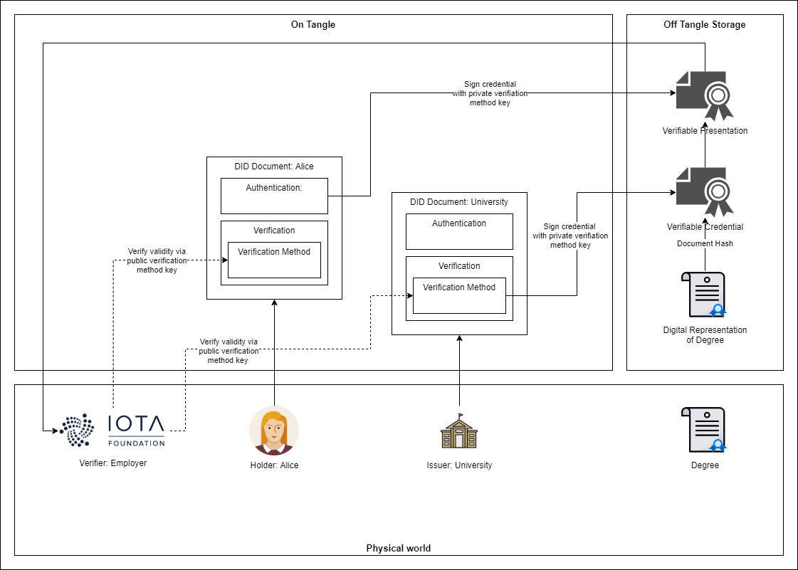

### IOTA Identity Tutorial (WASM-Binding)

#### Problem Description
Within the following code examples you will utilize the [WASM binding of the IOTA Identity framework](https://github.com/iotaledger/identity.rs/tree/dev/bindings/wasm/examples) to solve the problem described below:
> Alice recently graduated from the University of Oslo with a Bachelors of Computer Science. Now she wants to apply for a remote job at the IOTA Foundation and needs to digitally prove the existence and validity of her degree. What she needs is an immutable and verifiable credential, which has been approved by both the University of Oslo and herself, before presenting it to her possible new employer.

#### Roles
As described [here](https://www.iota.org/solutions/digital-identity), IOTA Identity builds on the W3C's proposed standards for a digital identity framework and thus is based on three roles:
- Holder (Alice)
- Issuer (University of Oslo)
- Verifier (IOTA Foundation)

#### Steps
In this process, you will complete the following steps from the perspective of one of the mentioned roles:
1. Holder: Create a DID (Decentralized Identifier) document for Alice
2. Issuer: Create a DID document for the University of Oslo
3. Issuer: Add a verification method to the University's DID document with the purpose to verify Alice's degree
4. Holder: Add a verification method to Alice's DID document with the purpose to present her degree to a third party
5. Holder: Setup a document representing Alice's degree, containing her DID
6. Issuer: Sign degree document with the private key of the University's verification method for a verifiable credential
7. Holder: Alice verifies the credentials to make sure it was actually signed by key associated to the University DID
8. Holder: Alice signs verifiable credential with private key of Alices's verification method for a verifiable presentation
9. Verifier: Verify Alice's and the University's signatures with their respective public keys

#### Code Examples
Examples should be executed in following order:
* [createDid.js](createDid.js)
* [addVerificationMethod.js](addVerificationMethod.js)
* [createVerifiableCredential.js](createVerifiableCredential.js)
* [checkVerifiableCredential.js](checkVerifiableCredential.js)
* [createVerifiablePresentation.js](createVerifiablePresentation.js)
* [checkVerifiablePresentation.js](checkVerifiablePresentation.js)
* [removeVerificationMethod.js](removeVerificationMethod.js)